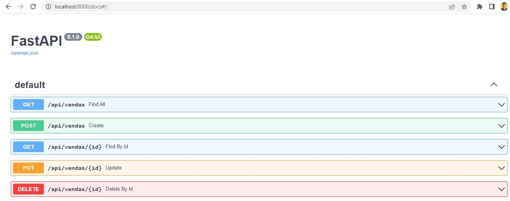

# API_building__FastAPI_SQLAlchemy
Learning about FastAPI for building APIs.

In this project I created a simple API for registering and reading sales data, using the FastAPI framework and the SQLAlchemy ORM for interaction with the SQLite Database.

There are many features that have not yet been explored, especially those that customize and improve the API documentation, but the initial goal was learning to build the API with its basic CRUD operations.

This code was produced with Python version 3.8., in a virtual environment described in the "requirements.txt" file.

This repository contains the following files:

database.py -> settings for connection to SQLite database, using SQLAlchemy

models.py -> contains classes that represent the table in the database

schemas.py -> contains classes that represent the data that will be received and returned in a request

repositories.py -> contains classes representing code for basic CRUD operations

main.py -> in the main file there are the routes for creating, reading in full or by id, updating and deleting sales.

The API has been tested and is in perfect working order.

  

